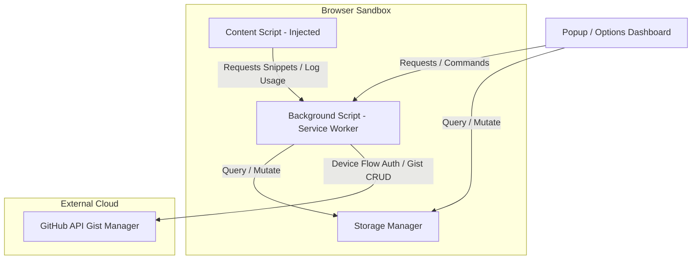

# 🚀 TypeWise - Codebase Knowledge Base & Development Guide

Welcome! This file serves as the core reference documentation for the **TypeWise** Smart Text Expansion browser extension. It outlines the codebase architecture, development commands, competitor analysis, and detailed blueprints for upcoming features to make this the ultimate text expansion tool for Firefox (specifically Zen Browser) and Chrome.

---

## 📁 Repository Overview & Architecture

TypeWise is a privacy-first, free browser extension that runs locally, performs client-side text expansion, and supports optional end-to-end encrypted backup/sync via private GitHub Gists.

### 🧩 Core Component Roles

1. **[Content Script](file:///E:/Documents/Rahul%20Pal/Coding/Browser%20Extention/typewise-extension/src/content/content.ts)**:
   - Injected into all web pages (`<all_urls>`).
   - Listens to keydown and input events to trace snippet shortcuts (e.g., `/thanks`).
   - Performs text replacement inside active input/textarea/contenteditable elements.
   - Triggers the inline Quick Search interface (triggered via `Ctrl+Space` or `Ctrl+Shift+K`).

2. **[Background Script](file:///E:/Documents/Rahul%20Pal/Coding/Browser%20Extention/typewise-extension/src/background/background.ts)**:
   - Operates as a background Service Worker.
   - Manages context menus ("Insert Snippet", "Create Snippet from Selection").
   - Coordinates cross-script messaging (`GET_SNIPPETS`, `SAVE_SNIPPET`, `DELETE_SNIPPET`, `UPDATE_SETTINGS`).
   - Runs background timers (e.g., auto-backup to GitHub Gist every 30 minutes).

3. **[Storage Manager](file:///E:/Documents/Rahul%20Pal/Coding/Browser%20Extention/typewise-extension/src/utils/storage.ts)**:
   - Stores user settings and snippets in `chrome.storage.local`.
   - Syncs encrypted data to `chrome.storage.sync` if `syncEnabled` is true.
   - Employs **AES-GCM (256-bit) encryption** using a locally generated crypto key that never leaves the browser.
   - Supports automated fallback to legacy storage structures during updates.

4. **[GitHub Gist Manager](file:///E:/Documents/Rahul%20Pal/Coding/Browser%20Extention/typewise-extension/src/api/gistManager.ts)**:
   - Uses the GitHub Device Flow OAuth mechanism for simple, token-less configuration.
   - Encrypts snippets before uploading to a private Gist to preserve user privacy.

---

## 🛠️ Development & Build Setup

The project is built using **Webpack** and **TypeScript** with conditional configuration for Chrome (Manifest V3) and Firefox.

### 📋 Main Commands

* **Install dependencies**: `npm install`
* **Watch Mode (Development)**: `npm run dev` (Re-builds on code change)
* **Build Both Engines**: `npm run build` (or `npm run build:all`)
* **Build Chrome MV3**: `npm run build:chrome`
* **Build Firefox (MV3 compliant)**: `npm run build:firefox`
* **Clean Build Output**: `npm run clean`
* **Run Tests**: `npm run test`

---

## 🏆 Competitor Analysis & Firefox Opportunity

Currently, the two market-leading text expander extensions have zero direct support for Firefox:

1. **Text Blaze**:
   - *Status on Firefox*: **No extension available**. Recommends native desktop application.
   - *Key Features*: Dynamic variables, logic/conditional templates, interactive forms, high performance.
2. **Magical**:
   - *Status on Firefox*: **No extension available**. Restricted to Chrome and Microsoft Edge.
   - *Key Features*: AI-driven response suggestions, auto-filling tables, cross-site variable mapping.

### 💡 The Opportunity for TypeWise
TypeWise has a massive advantage: it supports **Firefox / Zen Browser** natively while maintaining Chrome compatibility. Since Zen Browser has gained huge traction among power users, developers, and writers due to vertical tabs and its clean UI, building a beautiful, ultra-premium text expander tailormade for this ecosystem is a major market gap.

---

## 🎯 Improvement Strategy & Plan

To elevate TypeWise to be "the best of all," we have identified key improvement areas:

### 1. ⚙️ Robust ContentEditable Support (Implemented)
* **Problem**: Standard text inputs like `<input>` and `<textarea>` are fully supported. However, most modern writing platforms (Gmail, Notion, Slack, Discord, Twitter, Google Docs, GitHub comments) use `contenteditable` divs. Currently, TypeWise did not expand inside these.
* **Solution**:
  - Implemented a Selection & Range API replacement technique.
  - When a snippet matches, create a DOM Range spanning the trigger shortcut (e.g., `/hello`).
  - Execute `document.execCommand('insertText', false, expandedText)` or `document.execCommand('insertHTML', false, htmlText)` to replace the range while preserving the browser's native **Undo/Redo history**.

### 2. ⚡ Inline Variables, Forms, and Tab-Through Placeholders
* **Problem**: Currently variables are static (like `{{date}}`). If a template requires custom details (e.g., `Hello {{name}}, welcome to {{city}}!`), the user has to manually move their cursor back and edit them.
* **Solution**:
  - Support user-defined fields (e.g., `{{name:text}}`, `{{city:choice:London,Paris,Berlin}}`).
  - Upon shortcut trigger, render a tiny overlay or form modal next to the text caret.
  - Let users fill in the blanks using Tab and Enter to instantly insert the customized snippet.

### 3. 🎯 Caret Placement / Cursor Control (Implemented)
* **Problem**: Expanded text inserts the cursor at the very end of the text.
* **Solution**:
  - Supported a special `{{cursor}}` or `{{caret}}` keyword.
  - When expanding the text, replace `{{cursor}}` with empty text but set the active text node's Selection caret exactly at that offset.

### 4. 🎨 Glassmorphism & Zen Browser Aesthetic UI
* **Problem**: The current options dashboard and popup look nice but can be polished to feel like a premium native desktop application or a part of Zen Browser.
* **Solution**:
  - Add frosted-glass panels (`backdrop-filter`).
  - Create rich interactive visual stats (snippet usage counter graphs).
  - Use custom CSS tags and categories with smooth animations.

### 5. ⌨️ Advanced Keyboard & Trigger Engine (Implemented)
* **Problem**: Only expands on a pre-defined prefix trigger (`/`).
* **Solution**:
  - Added customizable trigger prefixes: `;`, `/`, `:`, `!`, or none.
  - Supported **Trigger-less matches** (prefix-less matching that expands on exact shortcut match + Space or Tab).
  - Supported **Case Sensitivity Toggles** per shortcut to match exactly as typed (e.g., distinguishing `/btw` and `/BTW`).

### 6. 🔊 Auditory Feedback & Synth Sounds (Implemented)
* **Problem**: Users lacked immediate confirmation upon successful expansion without toast overlays which might disrupt typing focus.
* **Solution**:
  - Integrated local oscillator click confirmation using Web Audio API (sine wave oscillator starting at 800Hz and decaying to 100Hz in 0.05 seconds, volume gain ramping from 0.3 to 0.001 exponentially).
  - Configurable via `playSounds` toggle in user settings.

### 7. ⏱️ Expansion Delays (Implemented)
* **Problem**: Fast typing can lead to accidental expansions when a shortcut is matches.
* **Solution**:
  - Added configurable delay (0s - 5s) under `expandDelay` property in User Settings, giving users a chance to preview and cancel text replacements.

### 8. 🌐 Enhanced Combobox & Textbox Roles Support (Implemented)
* **Problem**: Modern web applications (Slack, Discord, Notion, Jira) often use custom text nodes with roles instead of native `<textarea>` or `<input>` fields.
* **Solution**:
  - Expanded content script target recognition to include elements carrying `role="textbox"` and `role="combobox"`.

---

## ⚙️ Configuration Properties

| Property | Type | Default | Description |
|---|---|---|---|
| `theme` | `light` \| `dark` \| `system` | `'system'` | Interface theme choice. |
| `triggerKey` | `string` | `'/'` | Prefix trigger key (`;`, `/`, `:`, `!`). Empty `""` enables trigger-less space/tab matching. |
| `caseSensitive` | `boolean` | `false` | Distinguishes between uppercase and lowercase shortcut letters (e.g. `/btw` vs. `/BTW`). |
| `expandDelay` | `number` | `0` | Delay in seconds (0s - 5s) before expanding templates. |
| `playSounds` | `boolean` | `true` | Synthesizes a confirmation click sound using local oscillators. |
| `soundVolume` | `number` | `30` | Sound volume level (0-100 percentage) for the synthesized click sound. |
| `showNotifications` | `boolean` | `true` | Displays toast notifications on snippet expansion. |
| `syncEnabled` | `boolean` | `false` | Enables Gist cloud backup/restoration. |
| `autoBackup` | `boolean` | `false` | Automatic Gist backups every 30 minutes. |
