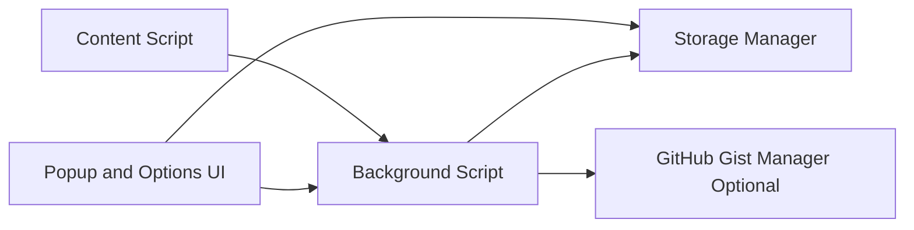

# TypeWise - Smart Text Expansion Extension

[](https://github.com/GoldLion123RP/typewise-extension/stargazers)
[](https://github.com/GoldLion123RP/typewise-extension/issues)
[](https://github.com/GoldLion123RP/typewise-extension/commits/main)
[](https://github.com/GoldLion123RP/typewise-extension/blob/main/LICENSE)

A free, privacy-focused text expansion extension for Chrome and Firefox with optional GitHub Gist sync.


## Links

- Repository: https://github.com/GoldLion123RP/typewise-extension
- Issues: https://github.com/GoldLion123RP/typewise-extension/issues
- New Bug Report: https://github.com/GoldLion123RP/typewise-extension/issues/new?labels=bug
- Feature Request: https://github.com/GoldLion123RP/typewise-extension/issues/new?labels=enhancement

## Features

- Smart text expansion via shortcuts
- Context menu integration for quick snippet actions
- Optional GitHub Gist sync for cloud backup
- Local encrypted storage flow
- Import and export for snippet portability
- Theme support (light, dark, system)
- Cross-browser build targets (Chrome and Firefox)

## Visual Architecture



## Run Locally (Firefox)

1. Install dependencies:

```bash
npm install
```

2. Build Firefox extension:

```bash
npm run build:firefox
```

3. Open Firefox debug page:

```text
about:debugging#/runtime/this-firefox
```

4. Click Load Temporary Add-on and select:

```text
dist/firefox/manifest.json
```

5. Open the extension popup, create a snippet, and test expansion in a text input.

## Security Notes

- Local-only mode works without any GitHub keys.
- GitHub authentication is optional and only needed for sync.
- Only a public GitHub OAuth Client ID should be used in extension builds.
- Never commit client secrets, private keys, local environment files, or build artifacts.

## Project Structure

```text
src/
	api/
	background/
	content/
	options/
	popup/
	styles/
	types/
	utils/
assets/
manifest.json
manifest.firefox.json
webpack.config.js
```

## Development Commands

```bash
npm run dev
npm run build:chrome
npm run build:firefox
npm run build:all
npm test
```

## Contributing

Contributions are welcome. See [CONTRIBUTING.md](CONTRIBUTING.md).

## License

MIT