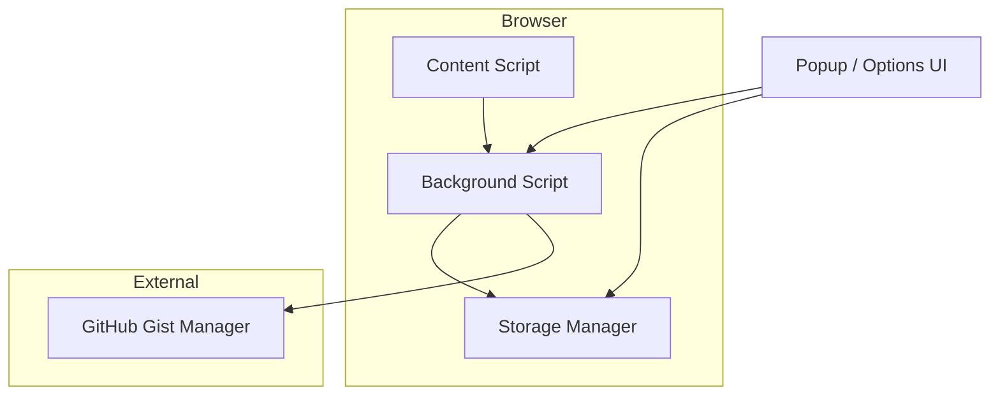

# 🚀 TypeWise - Smart Text Expansion Extension


A free, privacy-focused text expansion extension for Chrome and Firefox
>👨‍💻 Developed by Rahul Pal with optional GitHub Gist sync for cloud backup and cross-device synchronization.

<p align="center">
  
</p>

## 🔗 Links

- **Repository**: https://github.com/GoldLion123RP/typewise-extension
- **Issues**: https://github.com/GoldLion123RP/typewise-extension/issues
- **New Bug Report**: https://github.com/GoldLion123RP/typewise-extension/issues/new?labels=bug
- **Feature Request**: https://github.com/GoldLion123RP/typewise-extension/issues/new?labels=enhancement

---

## ✨ Features

### 🔤 Core Text Expansion
- **Shortcut-based expansion**: Type a trigger key (default `/`) followed by your keyword to instantly expand text
- **Dynamic variables**: Auto-replace placeholders like `{{date}}`, `{{time}}`, `{{datetime}}`, `{{year}}`, `{{month}}`, `{{day}}`, `{{timestamp}}`
- **Usage tracking**: Automatic counter for each snippet to track how often they are used
- **Categories & tags**: Organize snippets with categories and tags for easy management

### 📝 Snippet Management
- **Quick popup**: ✅ Click the extension icon to instantly access and insert snippets
- **Full options page**: Comprehensive settings and snippet management interface
- **Search & filter**: Real-time search across snippet titles, content, shortcuts, and tags
- **Import/Export**: JSON format for easy backup and portability

### ☁️ Cloud Sync (Optional)
- **GitHub Gist integration**: Sync snippets to a private GitHub Gist
- **Auto-backup**: Optional automatic backup every 30 minutes
- **Pull from Gist**: Restore snippets from cloud backup

### 🎨 User Interface
- **Dark theme**: Modern glass-morphism dark UI
- **Toast notifications**: Subtle feedback for expansions and actions
- **Context menus**: Right-click integration for quick actions

### ⌨️ Keyboard Shortcuts
- `Ctrl+Shift+Space` (Cmd+Shift+Space on Mac): Open TypeWise popup
- `Ctrl+Shift+K` (Cmd+Shift+K on Mac): Quick search mode

---

## 🏗️ Architecture



### 🧩 Components

| Component | Purpose |
|-----------|--------|
| **Content Script** (`content.ts`) | Monitors text inputs, detects triggers, performs text expansion |
| **Background Script** (`background.ts`) | Handles context menus, keyboard commands, sync, notifications |
| **Popup** (`popup.ts`) | Quick access UI for snippet insertion |
| **Options** (`options.ts`) | Full settings and snippet management |
| **Storage Manager** (`storage.ts`) | Encrypted local storage with merge logic |
| **Gist Manager** (`gistManager.ts`) | GitHub Gist API for cloud sync |

---

## 📖 Usage Examples

### 📝 Creating Your First Snippet

1. Click the TypeWise extension icon
2. Click **Add New Snippet**
3. Fill in the form:
   - **Title**: `Greeting`
   - **Shortcut**: `hello`
   - **Content**: `Hello! How can I help you today?`
4. Click **Save**

Now type ⌨️ `/hello` in any text field to expand it instantly!

### 📅 Using Variables

Create snippets with dynamic content:

```
Title: Current Date
Shortcut: /date
Content: Today is {{date}}
```

Expands to: `Today is 04/12/2026`

Available variables:
- `{{date}}` - Local date string
- `{{time}}` - Local time string
- `{{datetime}}` - Full local date/time
- `{{year}}` - Current year
- `{{month}}` - Two-digit month (01-12)
- `{{day}}` - Two-digit day (01-31)
- `{{timestamp}}` - Unix timestamp

### ☁️ Syncing with GitHub

1. Open Options (click gear icon or right-click extension → Options)
2. Go to the **Sync** tab
3. Click **Connect GitHub Account**
4. Authorize with GitHub device flow in your browser
5. ✅ Enable **Sync Enabled** toggle
6. Optionally enable **Auto Backup**

✨ Security note: the extension uses a public GitHub OAuth client ID and device flow, so no client secret is stored in the repo or required in the extension.

---

## 💾 Installation

### 🦊 Firefox

```bash
# Install dependencies
npm install

# Build Firefox extension
npm run build:firefox
```

1. Open `about:debugging#/runtime/this-firefox`
2. Click **Load Temporary Add-on**
3. Navigate to `dist/firefox/manifest.json`
4. Click **Select**

### 🌐 Chrome

```bash
# Build Chrome extension
npm run build:chrome
```

1. Open `chrome://extensions/`
2. Enable **Developer mode** (toggle in top right)
3. Click **Load unpacked**
4. Navigate to `dist/chrome/`

### 📦 Package for Distribution

```bash
# Create .zip for Firefox
npm run package:firefox

# Create .zip for Chrome
npm run package:chrome
```

---

## 🔧 Development Commands

```bash
npm run dev          # Watch mode - rebuild on file changes
npm run build       # Build both Chrome and Firefox
npm run build:chrome
npm run build:firefox
npm run build:all
npm run clean       # Clean dist folder
npm run lint       # ESLint check
npm run format     # Prettier formatting
npm run test       # Run tests
```

---

## 📁 Project Structure

```
typewise-extension/
├── src/
│   ├── api/
│   │   ├── gistManager.ts      # GitHub Gist sync
│   │   └── github.config.ts  # GitHub OAuth config
│   ├── background/
│   │   └── background.ts   # Service worker
│   ├── content/
│   │   └── content.ts     # Text expansion logic
│   ├── options/
│   │   ├── options.ts    # Settings page
│   │   ├── options.html
│   │   └── options.css
│   ├── popup/
│   │   ├── popup.ts    # Quick access popup
│   │   ├── popup.html
│   │   └── popup.css
│   ├── styles/
│   │   └── common.css  # Shared styles
│   ├── types/
│   │   └── index.ts   # TypeScript interfaces
│   └── utils/
│       └── storage.ts   # Encrypted storage
├── assets/
│   └── icons/             # Extension icons
├── manifest.json          # Chrome manifest (MV3)
├── manifest.firefox.json  # Firefox manifest
├── webpack.config.js
└── package.json
```

---

## 🔒 Security

- **Local-only mode**: Works fully without any GitHub authentication
- **Encrypted storage**: All snippets encrypted with AES before storing
- **No telemetry**: No data sent to external servers (except GitHub Gist when enabled)
- **Optional sync**: GitHub sync requires explicit user action
- **Safer GitHub sign-in**: Uses device-flow authorization instead of exchanging an auth code inside the extension

### 🔐 Security Best Practices

1. Never commit client secrets or OAuth tokens
2. Use only public OAuth Client IDs in extension builds
3. Keep `.env` files in `.gitignore`
4. Review `manifest.json` permissions before publishing

---

## 🔐 Browser Permissions

| Permission | Purpose |
|------------|---------|
| `storage` | Save snippets and settings locally |
| `contextMenus` | Right-click menu integration |
| `activeTab` | Access current tab for snippet insertion |
| `clipboardWrite` | Copy snippet content |
| `identity` | GitHub OAuth authentication |
| `notifications` | Toast feedback |
| `scripting` | Inject quick search UI |
| `host_permissions` | GitHub API access |

---

## 📦 Default Snippets

The extension ships with these starter snippets:

| Shortcut | Content |
|---------|---------|
| `/hello` | Hello! How can I help you today? |
| `/thanks` | Thank you for your time. Have a great day! |
| `/email` | Best regards, Rahul Pal |

---

## ❓ Troubleshooting

### 🚫 Extension not loading
- Make sure you're loading `manifest.json` from the `dist` folder, not source
- Check for errors in `about:debugging` or `chrome://extensions`

### ⏱️ Text not expanding
- Ensure the snippet is marked as **Active**
- Check the shortcut starts with the trigger key (`/` by default)
- Verify the text field is su

### ⚠️ GitHub sync failing
- Verify OAuth is properly configured with your Client ID
- Check that credentials are saved in the sync tab

---

## 🤝 Contributing

Contributions are welcome! Please read the [contributing guidelines](CONTRIBUTING.md) first.

---

## 📜 License

MIT
